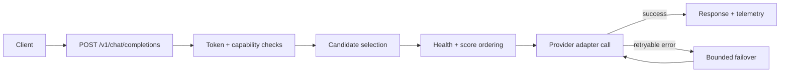
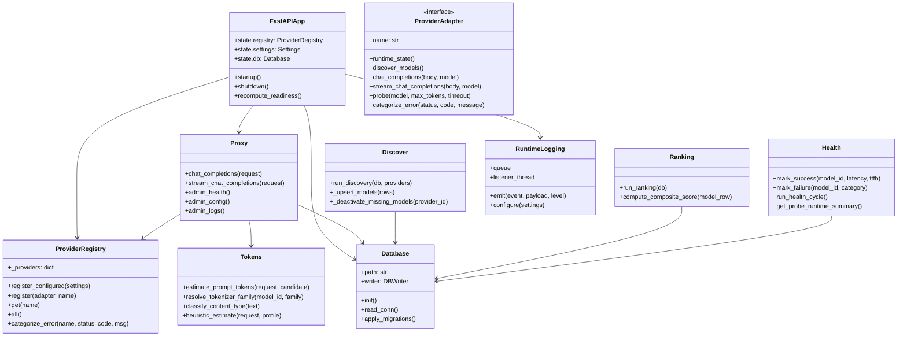
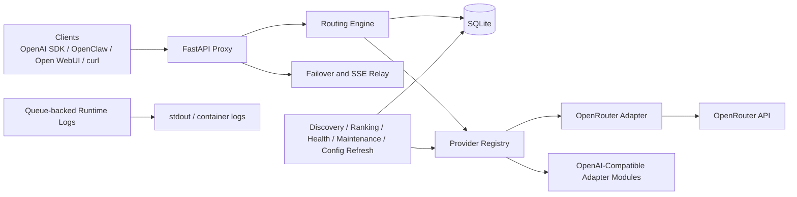

<div align="center">

# FreeLunch

**A self-hosted, OpenAI-compatible gateway that routes requests to the best available free model.**

*"There's no such thing as a free lunch." -Idiots*

[](./LICENSE)
[](./pyproject.toml)
[](./docker-compose.yml)
[](https://fastapi.tiangolo.com/)

[Quick Start](#quick-start) · [How It Works](#how-it-works) · [Project Model](#project-model) · [Testing Guide](./TESTING.md) · [Docs Map](#documentation-map)

</div>

## Why this project exists

Model/provider availability changes constantly. FreeLunch gives clients one stable `/v1` API while the gateway handles discovery, health-aware routing, and bounded failover.

## What you get

| Capability | What it does |
|---|---|
| OpenAI-compatible gateway | Use standard chat/models client flows |
| Health-aware routing | Prefer healthy/capable candidates |
| Bounded failover | Retry alternates without unbounded loops |
| Admin observability | `/admin/health`, `/admin/config`, `/admin/logs` |
| Durable telemetry | Request/probe evidence in SQLite |
| Low operational overhead | Single-node design with SQLite + scheduler loops |

## Quick Start

1. Prerequisites:
   - Docker + Compose v2 must already be installed and running.
   - Installer bootstrap requires `OPENROUTER_API_KEY`.
   - Additional provider keys can be added post-install by enabling those providers in `config.yaml`.
   - The installer validates Docker; it does not install Docker for you.
2. Install (pick one):

Linux / macOS

```bash
curl -fsSL https://raw.githubusercontent.com/jetymas/FreeLunch/main/install.sh | sh
```

Windows PowerShell

```powershell
irm https://raw.githubusercontent.com/jetymas/FreeLunch/main/install.ps1 | iex
```

3. Set API keys:
   - Installer flow: keys are stored in `~/.freelunch/.env` (Windows: `%USERPROFILE%\\.freelunch\\.env`).
   - Repo/docker-compose flow: copy `.env.example` to `.env` and set keys there.
   - Required for installer/default provider bootstrap: `OPENROUTER_API_KEY`.
   - Optional gateway auth key: `GATEWAY_API_KEY` (clients then send `Authorization: Bearer <key>`).

Example `.env` values:

```dotenv
OPENROUTER_API_KEY=sk-or-v1-...
GATEWAY_API_KEY=
```

4. Verify service:

```bash
curl http://localhost:8000/healthz
curl http://localhost:8000/readyz
curl http://localhost:8000/v1/models
```

5. Send a request:

```bash
curl http://localhost:8000/v1/chat/completions \
  -H "Content-Type: application/json" \
  -d "{\"model\":\"auto\",\"messages\":[{\"role\":\"user\",\"content\":\"hello\"}]}"
```

### OpenAI SDK example

```python
from openai import OpenAI

client = OpenAI(base_url="http://localhost:8000/v1", api_key="unused")
resp = client.chat.completions.create(
    model="auto",
    messages=[{"role": "user", "content": "Give me a one-line summary of FreeLunch."}],
)
print(resp.choices[0].message.content)
```

### Use With Other Clients

Most OpenAI-compatible clients only need a base URL and model name.

- Base URL: `http://localhost:8000/v1`
- Model: `auto` (recommended default)
- API key: many clients require a value; if so, use any placeholder unless your deployment enforces gateway auth

If `GATEWAY_API_KEY` is set, send `Authorization: Bearer <your-key>` with requests.

## Security Notes

- Keep real provider keys only in local `.env` files or your deployment secret store; do not commit populated secrets.
- Rotate all provider and gateway keys before/at public release, then restart the gateway so runtime picks up rotated credentials.
- Treat leaked keys as compromised even if exposure was brief, and replace them immediately.

## How It Works

At a high level:

- FreeLunch receives OpenAI-style requests on `/v1`.
- It estimates request requirements (tokens/capabilities) and picks viable model candidates.
- Candidates are ranked using health + performance + policy signals.
- If a provider fails with retryable errors, FreeLunch fails over to alternates within bounded attempts.
- Outcomes and telemetry are logged so operators can inspect behavior and tune settings.



All of this typically adds only a few milliseconds of gateway overhead per request.

## Project Model



## Documentation Map

- `README.md`: user onboarding and day-1 usage
- `TESTING.md`: canonical testing strategy, quality targets, and validation roadmap
- `RELEASE_VALIDATION_MATRIX.md`: manual cross-platform release sign-off checklist and evidence template
- `RELEASE_VALIDATION_EVIDENCE.md`: executed release-matrix results and blocker tracking
- `IMPLEMENTATION_GUIDE.md`: deep technical internals (canonical implementation reference)
- `OPERATIONS.md`: operator runbook
- `CONTRIBUTING.md`: developer workflow
- `FREELUNCH_SPEC_v8.md`: spec/policy target
- `SPEC_GAP_REVIEW.md`: implementation alignment snapshot
- `TASKS.md`: active backlog
- `AGENTS.md`: agent execution guidance

## Logs And Important Options

Use these controls to inspect runtime behavior and tune the gateway:

- Runtime logs are enabled by default and written to process/container output.
- Set verbosity in `config.yaml` under `logging.runtime_verbosity: concise | verbose | debug`.
- For installer deployments, edit `~/.freelunch/config.yaml` and restart the container.
- You can also change allowed keys live with `PUT /admin/config/{key}` (stored as overrides in SQLite).

Runtime-overridable keys (via `PUT /admin/config/{key}`):

- `routing.max_attempts`
- `logging.runtime_verbosity`
- `health.probe_interval_minutes`

Config/env + restart keys (not runtime-overridable):

- `providers.enabled`
- `providers.<id>.enabled`
- `providers.<id>.inference_enabled`
- provider API key env vars such as `OPENROUTER_API_KEY`

Quick admin requests:

```bash
# If gateway auth is enabled, include:
# -H "Authorization: Bearer <gateway_api_key>"

curl http://localhost:8000/admin/health
curl http://localhost:8000/admin/config
curl "http://localhost:8000/admin/logs?limit=50"
curl -X PUT http://localhost:8000/admin/config/logging.runtime_verbosity \
  -H "Content-Type: application/json" \
  -d "{\"value\":\"debug\"}"
```

## Quick Structure Snapshot

```text
scripts/provider_smoke.py
src/main.py
src/proxy.py
src/providers/*
src/db.py
src/health.py
src/ranking.py
src/tokens.py
tests/*
```

---
<details>
<summary><strong>Legacy Deep Dive (Preserved)</strong></summary>

<div align="center">

# FreeLunch

**A self-hosted, OpenAI-compatible gateway that routes requests to the best currently available free model.**

*There’s no such thing as a free lunch.*

[](./README.md)
[](https://www.python.org/)
[](https://fastapi.tiangolo.com/)
[](./LICENSE)

</div>

---

## Why this exists

Free model inventory changes constantly. A model that is healthy, fast, and free this morning may be rate-limited, degraded, or replaced by a better option tonight. Reconfiguring every OpenAI-compatible client every time that happens is operationally wasteful.

**FreeLunch** gives you one stable `/v1` endpoint and continuously handles:

- free-model discovery
- benchmark enrichment
- health-aware ranking
- capability-aware routing
- bounded failover across alternates
- operator visibility through admin endpoints, runtime logs, and durable request telemetry

The current implementation is intentionally **OpenRouter-first**. The architecture is provider-pluggable, but v1 stays narrow on purpose so runtime behavior is reliable and understandable.

## What FreeLunch is

FreeLunch is:

- an OpenAI-compatible HTTP gateway
- a single-node service with SQLite persistence
- a routing layer that chooses among discovered healthy free models
- a small scheduler that keeps model, health, benchmark, and config state fresh
- an operator-friendly service with JSON admin endpoints and queue-backed runtime logs

FreeLunch is not:

- a local inference runner
- a multi-node control plane
- a broad multi-provider integration layer on day one
- a web dashboard product

---

## Current implementation status

The repository is past scaffolding and into refinement. The current codebase includes:

- FastAPI app lifecycle with readiness gating
- SQLite migrations and a dedicated writer thread
- OpenRouter discovery, inference, streaming, probing, and normalized provider error handling
- benchmark refresh for Chatbot Arena and Open LLM
- routing that filters by health, capability, context fit, and request-time preferences
- request token estimation with exact local counters where safe and calibrated local heuristics elsewhere
- queue-backed runtime logging with `concise`, `verbose`, and `debug` modes
- provider-agnostic adapter/runtime hooks in registry/bootstrap paths
- provider-agnostic stream error categorization in proxy relay orchestration
- provider-neutral rank metadata (`provider_rank`) with backward-compatible `openrouter_rank` fallback
- admin endpoints for models, config, health, logs, and manual refresh
- installer scripts and CI coverage

Use these tracking documents together:

- `FREELUNCH_SPEC_v8.md`: the full target behavior
- `SPEC_GAP_REVIEW.md`: current implementation-vs-spec snapshot
- `TASKS.md`: active backlog
- `AGENTS.md`: repo-specific engineering constraints and workflow guidance

### Current provider-platform status

The provider-platform refactor is landed. Additional API-key providers now use module-plus-config onboarding without provider-specific changes in core routing/proxy/health paths.

Current status:

- OpenRouter remains the default and most validated provider path
- first-wave OpenAI-compatible provider modules are now present (OpenAI, Together, Groq, DeepSeek, xAI, Cerebras, Perplexity, Nvidia)
- provider hardening is now focused on regression depth and operator guidance, not core platform rewrites

---

## Architecture at a glance



Core rules:

1. Clients talk to one stable OpenAI-style API surface.
2. Routing, health, and proxy orchestration stay provider-agnostic.
3. Provider quirks belong inside `src/providers/*`.
4. SQLite is treated as a single-node durability layer, not a distributed database.
5. Application writes flow through one writer thread.
6. Runtime logs are operational events, not a replacement for durable request telemetry.

---

## Quick start

### Option 1: bootstrap installer

These scripts assume Docker is already installed and running.

Linux / macOS:

```bash
curl -fsSL https://raw.githubusercontent.com/jetymas/FreeLunch/main/install.sh | sh
```

Windows PowerShell:

```powershell
irm https://raw.githubusercontent.com/jetymas/FreeLunch/main/install.ps1 | iex
```

The installers:

- create a Docker-based deployment under `~/.freelunch`
- prompt for or consume `OPENROUTER_API_KEY`
- write `.env` and runtime config
- pull `ghcr.io/jetymas/freelunch:latest`
- start the gateway

Supported unattended inputs include:

- `OPENROUTER_API_KEY`
- `GATEWAY_API_KEY`
- `FREELUNCH_PORT`
- `FREELUNCH_INSTALL_DIR`
- `FREELUNCH_AUTO_CONFIRM=yes`

### Option 2: manual Docker setup

```bash
git clone https://github.com/jetymas/FreeLunch.git
cd FreeLunch
cp config.yaml.example config.yaml
cp .env.example .env
```

Set at least:

```bash
OPENROUTER_API_KEY=sk-or-v1-...
GATEWAY_API_KEY=
```

Then start:

```bash
docker compose up -d
```

### Option 3: local non-Docker run

```bash
python -m venv .venv
. .venv/bin/activate
pip install -r requirements.txt -r requirements-dev.txt
uvicorn src.main:app --host 0.0.0.0 --port 8000
```

### Verify startup

```bash
curl http://localhost:8000/healthz
curl http://localhost:8000/readyz
curl http://localhost:8000/v1/models
```

`/healthz` only means the process is alive. `/readyz` stays `503` until:

- DB migrations succeed
- bootstrap discovery completes
- at least one active, healthy, routable model exists

### Send a request

```bash
curl http://localhost:8000/v1/chat/completions \
  -H "Content-Type: application/json" \
  -H "Authorization: Bearer $GATEWAY_API_KEY" \
  -d '{
    "model": "auto",
    "messages": [{"role": "user", "content": "Reply with one short sentence."}],
    "stream": false
  }'
```

---

## Client compatibility

FreeLunch exposes the familiar OpenAI-style shape:

- `GET /v1/models`
- `POST /v1/chat/completions`

It is intended to work with:

- OpenAI SDKs
- Open WebUI
- OpenClaw
- Kilo Code
- curl and custom OpenAI-compatible clients

Typical client configuration:

- Base URL: `http://<host>:8000/v1`
- Model: `auto`
- API key: your `GATEWAY_API_KEY` if gateway auth is enabled

If a client insists on a key even when gateway auth is disabled, a placeholder usually works.
`GET /v1/models` also includes a synthetic `auto` entry for strict OpenAI-compatible clients that validate model names before sending requests.

### Python OpenAI SDK example

```python
from openai import OpenAI

client = OpenAI(
    base_url="http://localhost:8000/v1",
    api_key="your-gateway-key-or-placeholder",
)

response = client.chat.completions.create(
    model="auto",
    messages=[{"role": "user", "content": "Summarize why failover matters."}],
)

print(response.choices[0].message.content)
```

### Optional request-time routing headers

When `routing.enable_request_preference_headers` is enabled, clients may send:

- `X-Gateway-Preference: balanced|quality|latency|context|reliability`
- `X-Gateway-Max-Latency-Ms: <int>`
- `X-Gateway-Min-Context: <int>`

These are preferences, not hard SLAs.

---

## Operational model

### Startup and readiness

The app boots through `src/main.py` and:

1. loads config and environment
2. configures queue-backed runtime logging
3. initializes SQLite and migrations
4. starts the writer thread
5. registers enabled providers
6. runs the startup discovery pipeline
7. recomputes readiness
8. starts recurring scheduler jobs

If OpenRouter is configured but cannot actually route requests at runtime, persisted rows are not trusted blindly. Models are deactivated when the provider is not inference-capable.

### Discovery and model lifecycle

Discovery is handled through provider adapters and normalized into the `models` table.

Current behavior:

- only free OpenRouter models are considered
- disappeared provider rows are deactivated on later discovery runs
- benchmark data from `leaderboard_cache` is joined by normalized model name
- discovery attempts best-effort benchmark refresh before upserting provider rows
- benchmark fetch failures degrade to missing enrichment, not failed discovery

### Routing and failover

For each request, the gateway:

1. parses request requirements and optional routing preferences
2. builds a ranked candidate set
3. filters by health, activity, capabilities, context fit, and output-token limits
4. tries candidates in bounded order
5. fails over only on retryable provider errors

`CONTEXT_EXCEEDED` is treated specially:

- it is normalized as retryable for alternate-candidate selection
- if all exhausted attempts ended with `CONTEXT_EXCEEDED`, the final client response is `400`, not `502`
- context-only failures do not penalize model health

### Health and probe policy

Health combines:

- passive request outcomes
- bounded active probing
- cooldown and recovery behavior

Probe behavior is intentionally conservative:

- strict daily per-provider budgets
- capped startup probe count
- stale-model and cooldown-recovery targeting
- no aggressive exploration loops

### Persistence model

SQLite stores:

- discovered models
- request telemetry
- benchmark cache
- runtime config overrides

Important design choices:

- WAL mode
- one dedicated writer thread for application writes
- bounded write queue
- low-priority client request logs are lossy under pressure
- higher-priority metadata writes are protected by reserved queue capacity and blocking backpressure

---

## Runtime logging and durable telemetry

FreeLunch has two different logging/telemetry systems. They serve different purposes.

### 1. Runtime logs

Runtime logs are:

- queue-backed
- JSON-line formatted
- emitted on a separate listener thread
- intended for operators, container logs, and debugging

Configuration:

- `logging.runtime_enabled`
- `logging.runtime_verbosity`
- `logging.runtime_queue_size`

Verbosity levels:

- `concise`
  - startup and shutdown milestones
  - readiness changes
  - request failures and major outcomes
  - operator-facing state changes
- `verbose`
  - job completions
  - richer provider attempt summaries
  - benchmark refresh results
  - stream completion/failure lifecycle events
- `debug`
  - scheduler and candidate-selection trace detail
  - tokenizer resolution path
  - cache hits, pending preload state, heuristic fallback reason
  - detailed retry and request-attempt diagnostics

Queue behavior:

- low-priority runtime records can drop under pressure
- warning-and-above records still attempt fallback emission
- runtime logging is designed not to stall the hot request path

`GET /admin/health` includes a `runtime_logging` object with:

- `enabled`
- `verbosity`
- `queue_size`
- `queue_depth`
- `dropped_records`

### 2. SQLite `request_log`

`request_log` is:

- durable
- queryable through admin endpoints
- used by health, ranking, and token-estimation review
- separate from runtime logs

This distinction matters:

- disabling runtime logs does not disable health telemetry
- disabling low-priority client request persistence does not disable runtime logs
- probe/bootstrap telemetry continues to persist because health budgeting depends on it

---

## Token estimation pipeline

The token estimation pipeline is complete under the current **local-only** design policy.

Its job is not billing. Its job is pre-routing capacity estimation:

- can this prompt fit in the candidate’s context window?
- does the request require more completion capacity than the candidate exposes?
- should a smaller-context candidate be filtered before the request is sent?

### Exact local counting paths

FreeLunch uses exact local token counting when it can do so safely:

- `tiktoken` for OpenAI-compatible families and compatible tokenizer-family encodings
- Hugging Face `AutoTokenizer` for non-OpenAI families that can be resolved safely with:
  - `use_fast=True`
  - `trust_remote_code=False`

### Model-name normalization

The resolver handles common provider-to-tokenizer naming mismatches, including:

- OpenAI-prefixed GPT model IDs such as `openai/gpt-4o-mini`
- Cohere Command-R aliases
- DeepSeek org aliases
- StepFun / Z.AI org aliases
- Meta-Llama repo-name variants
- NVIDIA Nemotron repo patterns
- Mistral dated release suffixes
- mixed alphanumeric tokens like `R1`, `32B`, and `A22B`

### Heuristic fallback

For unresolved local-only families, the gateway falls back to a calibrated local heuristic that is:

- family-aware
- content-type-aware
- conservative

The broad content classes are:

- `prose`
- `code`
- `json`

This heuristic path is the intended behavior for the remaining closed or unresolved ecosystems under current project policy.

### Structured input handling

The estimator accounts for:

- multimodal vision content in OpenAI-style content arrays
- tools
- `response_format`
- `tool_calls`
- `function_call`
- `audio`
- `name`
- `tool_call_id`
- `refusal`

### Background tokenizer preload behavior

Discovery schedules best-effort background tokenizer preloads for non-OAI exact paths.

Important details:

- uncached families do not block the request path waiting for preload
- first-use requests can still fall back to heuristics while preload is pending
- successful tokenizer loads are cached in-process
- transient load failures are retried later
- shutdown cancellation of background preload futures is expected and now logs as a debug-only cancellation event rather than a warning-level failure

### Token-estimation review

The gateway records review evidence in `request_log`, including:

- selected provider model
- selected tokenizer family
- estimated prompt tokens
- selected context window snapshot
- provider-reported prompt tokens when available

`GET /admin/health` includes `token_estimation_review`, which summarizes the last 7 days for manual operator review.

Key fields/operators should watch:

- `context_exceeded_by_tokenizer_family`
- `context_failover_recoveries`
- `estimation_mismatch_by_tokenizer_family`
- `review_flags`

Those flags are advisory only. They do not auto-expand tokenizer support.

### Current policy

Under the accepted project policy:

- remote provider-native counting is not used on the request path
- tokenizer prewarming is not enabled by default
- the local-only token-estimation pipeline is treated as complete
- future work should be evidence-driven calibration or safe local mapping extensions

---

## Benchmark ingestion

Discovery enrichment currently uses two public sources:

- Chatbot Arena
- Open LLM leaderboard

### Current resilience behavior

Chatbot Arena refresh:

- tries the newest parseable `elo_results_*.pkl` snapshot first
- then newer-to-older `leaderboard_table_*.csv`
- then `arena_hard_auto_leaderboard_*.csv`

Open LLM refresh:

- uses the Hugging Face dataset API
- respects the current dataset-server row page-size limit
- walks the dataset in pages instead of assuming a larger `rows` request is always valid

Cache behavior:

- per-source freshness windows are respected
- refresh is skipped when cached source data is fresh enough

Operator expectation:

- this is still best-effort because public artifact schemas can drift
- benchmark failures should reduce enrichment quality, not take the gateway down

---

## OpenRouter behavior

The shipping provider is `openrouter`.

Current provider behavior includes:

- authenticated model discovery
- chat completions
- SSE streaming relay
- normalized retryable vs non-retryable error categories
- bounded retry logic inside the adapter for request transport failures

### Live production behavior

With a real OpenRouter key:

- discovery returns real free-model inventory
- app startup can become ready from real discovered rows
- `/v1/chat/completions` routes through the real provider path
- `/v1/models` exposes the active healthy model pool maintained by FreeLunch

### Dev stub behavior

The no-key OpenRouter stub still exists, but it is:

- explicit
- disabled by default
- honored only in `APP_ENV=dev`

Outside dev, `providers.openrouter.dev_stub_enabled` is ignored.

Production guidance:

- keep `providers.openrouter.dev_stub_enabled: false`
- set a real `OPENROUTER_API_KEY`
- expect persisted stale OpenRouter rows to be deactivated if runtime inference capability disappears

### Error normalization

Provider errors are normalized into categories such as:

- `RATE_LIMITED`
- `PROVIDER_UNAVAILABLE`
- `INVALID_REQUEST`
- `AUTH_ERROR`
- `CONTEXT_EXCEEDED`

This is what allows provider-specific behavior to stay in the adapter while routing and proxy logic remain provider-agnostic.

---

## Admin endpoints

FreeLunch exposes operator-facing JSON admin endpoints.

### Liveness and readiness

- `GET /healthz`
- `GET /readyz`

### Model inspection and control

- `GET /admin/models`
- `GET /admin/models/{id}`
- `POST /admin/models/{id}/disable`
- `POST /admin/models/{id}/enable`

### Health and runtime state

- `GET /admin/health`

This currently includes:

- bootstrap state
- DB writer queue depth
- runtime logging status
- model/provider summary
- scheduler job status
- probe budgets
- probe runtime state
- recent probe/bootstrap activity
- token-estimation review summary
- recent model error summary

### Config inspection and runtime overrides

- `GET /admin/config`
- `PUT /admin/config/{key}`
- `DELETE /admin/config/{key}`

Overrides apply to the running app and are also refreshed by a periodic `config_refresh` scheduler job.

### Manual refresh

- `POST /admin/refresh`

This forces an immediate discovery/ranking pass through the same discovery runner used by scheduled jobs.

### Recent request telemetry

- `GET /admin/logs`

This is sourced from durable SQLite telemetry, not the runtime log queue.

---

## Configuration guide

`config.yaml.example` is the best concise reference for currently implemented settings. The main groups are:

- `app`
- `providers`
- `discovery`
- `routing`
- `ranking`
- `health`
- `logging`

### Provider gating

There are four different control surfaces and they are intentionally distinct:

- `providers.enabled`
  - global allow-list
- `providers.<name>.enabled`
  - disables the provider entirely
- `providers.<name>.discovery_enabled`
  - keeps it out of discovery while preserving runtime semantics for already-known rows
- `providers.<name>.inference_enabled`
  - removes it from routing/probing and deactivates its rows until it is re-enabled and rediscovered

### Provider key env mapping (`providers.<id>.api_key_env`)

For OpenAI-compatible providers (`openai`, `together`, `groq`, `deepseek`, `xai`, `cerebras`, `perplexity`, `nvidia`), credentials are resolved from:

1. environment variable named by `providers.<id>.api_key_env`
2. fallback inline `providers.<id>.api_key` (if set)

If `providers.<id>.api_key_env` is omitted, defaults are:

- `openai`: `OPENAI_API_KEY`
- `together`: `TOGETHER_API_KEY`
- `groq`: `GROQ_API_KEY`
- `deepseek`: `DEEPSEEK_API_KEY`
- `xai`: `XAI_API_KEY`
- `cerebras`: `CEREBRAS_API_KEY`
- `perplexity`: `PERPLEXITY_API_KEY`
- `nvidia`: `NVIDIA_API_KEY`

OpenRouter remains separate and uses `OPENROUTER_API_KEY` plus `providers.openrouter.dev_stub_enabled` for explicit dev-only no-key mode.

### Logging settings

```yaml
logging:
  runtime_enabled: true
  runtime_verbosity: concise
  runtime_queue_size: 1000
  request_log_enabled: true
  log_queue_size: 5000
  request_log_retention_days: 30
```

### Health and budget settings

Probe policy is intentionally conservative. The most important operator knobs are:

- `health.probe_interval_minutes`
- `health.max_probes_per_run`
- `health.startup_probe_limit`
- `health.daily_request_budget_by_provider`

### Discovery and benchmark settings

The benchmark refresh cadence is operator-controlled:

- `discovery.interval_minutes`
- `discovery.request_timeout_seconds`
- `discovery.leaderboard.chatbot_arena.enabled`
- `discovery.leaderboard.chatbot_arena.cache_hours`
- `discovery.leaderboard.open_llm.enabled`
- `discovery.leaderboard.open_llm.cache_hours`

---

## Recommended production posture

For a real deployment:

1. set at least one real provider key (`OPENROUTER_API_KEY` or provider-specific key env)
2. keep `providers.openrouter.dev_stub_enabled: false`
3. leave runtime logging enabled at `concise` unless diagnosing something specific
4. watch `/readyz` and `/admin/health`
5. treat benchmark refresh failures as enrichment degradation, not an immediate outage
6. treat `GET /admin/health -> token_estimation_review.review_flags` as manual investigation triggers

If you do not want outbound Hugging Face tokenizer downloads:

- the gateway still works
- unresolved families fall back to heuristics
- use `GET /admin/health -> token_estimation_review` to watch for drift

If you do allow Hugging Face tokenizer access:

- exact non-OAI sizing improves over time as tokenizer assets are loaded and cached
- first-use requests still do not block on preload; they may temporarily use heuristics while preload completes

---

## Local development

Common commands:

```bash
python -m ruff check .
python -m mypy src
python -m pytest tests -q --basetemp .pytest_tmp_local -p no:cacheprovider
python -m pytest tests --cov=src --cov-report=term-missing -q --basetemp .pytest_tmp_cov -p no:cacheprovider
```

Python 3.14 warning-hygiene baseline:

- `fastapi==0.115.14`
- `starlette==0.46.2`
- `pytest==8.4.2`
- `pytest-asyncio==0.26.0`

Remaining deprecation noise is currently upstream and is filtered narrowly in `pyproject.toml` under `tool.pytest.ini_options.filterwarnings` for known warnings from `fastapi.routing` and `pytest_asyncio.plugin` only.

Focused examples:

```bash
python -m pytest tests/test_openrouter.py -q --basetemp .pytest_tmp_openrouter -p no:cacheprovider
python -m pytest tests/test_tokens.py -q --basetemp .pytest_tmp_tokens -p no:cacheprovider
uvicorn src.main:app --reload --host 0.0.0.0 --port 8000
```

### Optional manual live-provider smoke harness

Use the included script:

```bash
python scripts/provider_smoke.py --help
python scripts/provider_smoke.py --json
```

Examples:

```bash
python scripts/provider_smoke.py
python scripts/provider_smoke.py --provider openrouter --provider openai
python scripts/provider_smoke.py --config config.yaml --json
```

Run in budget-aware mode (single minimal discovery check per provider first; no broad matrices by default).

Pass/skip/fail interpretation:

- pass: provider discovery smoke succeeded and returned at least one model
- skip: provider intentionally not enabled or no key is configured for its `providers.<id>.api_key_env`; provider should be runtime-disabled and excluded from routing
- fail: provider enabled but unregistered, or keyed-enabled provider fails discovery due transport/provider/runtime errors

Useful manual probes:

```bash
curl http://localhost:8000/healthz
curl http://localhost:8000/readyz
curl http://localhost:8000/v1/models
curl http://localhost:8000/admin/health
```

See [CONTRIBUTING.md](./CONTRIBUTING.md) for workflow expectations and doc-sync requirements.

---

## Repository layout

```text
scripts/
└── provider_smoke.py
src/
├── benchmarks.py
├── config.py
├── db.py
├── discover.py
├── health.py
├── main.py
├── proxy.py
├── ranking.py
├── routing.py
├── runtime_logging.py
├── scheduler.py
├── tokens.py
└── providers/
    ├── base.py
    ├── openai_compatible.py
    ├── openai.py
    ├── together.py
    ├── groq.py
    ├── deepseek.py
    ├── xai.py
    ├── cerebras.py
    ├── perplexity.py
    ├── nvidia.py
    ├── registry.py
    └── openrouter.py
tests/
├── test_openai_compatible.py
└── test_provider_smoke.py
```

Key docs:

- `FREELUNCH_SPEC_v8.md`
- `SPEC_GAP_REVIEW.md`
- `TASKS.md`
- `AGENTS.md`
- `CONTRIBUTING.md`
- `CHANGELOG.md`

---

## Roadmap

Near-term execution direction:

- expand multi-provider startup/readiness/routing regression coverage
- keep benchmark-ingestion parsing resilient as upstream artifacts drift
- keep operator/install docs synchronized with runtime behavior and provider onboarding policy

The current design still prioritizes:

- predictable runtime behavior
- low operational overhead
- provider-boundary cleanliness
- single-node reliability before complexity

---

## License

MIT.

---

## Publishing note

This README still uses `jetymas` as the publication token in example URLs. Replace it with the final GitHub owner or organization before public release.

</details>
