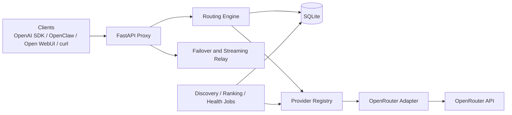

<div align="center">

# FreeLunch

**A self-hosted, OpenAI-compatible gateway that automatically routes requests to the best available free model.**

*There’s no such thing as a free lunch.*

[](./README.md)
[](https://www.python.org/)
[](https://fastapi.tiangolo.com/)
[](./LICENSE)

</div>

---


## Why the name

**FreeLunch** is named after the saying: *there’s no such thing as a free lunch.*
The project is built around squeezing useful work out of free-tier model endpoints while staying honest about limits, health, and tradeoffs.

## Why this exists

Free model availability changes constantly. Clients like OpenClaw, Open WebUI, Kilo Code, and standard OpenAI SDK apps should not need to be reconfigured every time a better free model appears or a provider becomes flaky.

**FreeLunch** gives you one stable `/v1` endpoint and handles the rest:
- discovers available free models
- ranks them using quality, health, and latency signals
- routes only to healthy, capability-compatible candidates
- fails over automatically when retryable provider errors occur

The initial shipping build is **OpenRouter-first**, with a provider-plugin architecture that makes future adapters straightforward to add.

---

## Highlights

- **OpenAI-compatible API** — drop-in `/v1/chat/completions` endpoint for OpenAI-style clients
- **Automatic model selection** — routes to the best available free model without manual switching
- **Bounded failover** — retries across ranked candidates on retryable provider failures
- **Provider plugin system** — provider-specific logic stays isolated in `src/providers/*`
- **Capability-aware routing** — filters by tools, vision, streaming, context size, and output limits
- **Low-overhead architecture** — single process, SQLite, one dedicated writer thread, conservative background work
- **Bootstrap readiness gating** — does not report ready until migrations, discovery, and initial routable state succeed
- **Operational endpoints** — `/healthz`, `/readyz`, and JSON admin APIs for inspection and debugging

---

## Architecture at a glance



### Core design rules

1. **Clients talk to one stable OpenAI-style endpoint.**
2. **Routing logic stays provider-agnostic.**
3. **Provider quirks live only inside adapter modules.**
4. **Health checks are passive-first and budget-aware.**
5. **All writes go through one SQLite writer path for stability.**

---

## What ships in v1

### Included
- `openrouter` provider adapter
- `/v1/chat/completions`
- `/v1/models`
- `/healthz` and `/readyz`
- admin inspection endpoints
- ranking, health, failover, migrations, request logging

### Explicitly out of scope
- local model execution (`ollama`, `llama.cpp`, `vLLM`)
- multi-node / horizontally scaled deployments
- embeddings routing in the initial release
- full browser dashboard
- broad multi-provider coverage on day one

---

## Quick start

### 1. Clone the repo

```bash
git clone https://github.com/jetymas/FreeLunch.git
cd FreeLunch
```

### 2. Configure it

```bash
cp config.yaml.example config.yaml
cp .env.example .env
```

Set at least:

```bash
OPENROUTER_API_KEY=sk-or-v1-...
# Optional
GATEWAY_API_KEY=
```

### 3. Start it

```bash
docker compose up -d
```

For a local non-Docker run:

```bash
python -m venv .venv
. .venv/bin/activate
pip install -r requirements.txt -r requirements-dev.txt
uvicorn src.main:app --host 0.0.0.0 --port 8000
```

### 4. Verify liveness and readiness

```bash
curl http://localhost:8000/healthz
curl http://localhost:8000/readyz
```

### 5. Send a request

```bash
curl http://localhost:8000/v1/chat/completions \
  -H "Content-Type: application/json" \
  -H "Authorization: Bearer $GATEWAY_API_KEY" \
  -d '{
    "model": "auto",
    "messages": [{"role": "user", "content": "Hello!"}],
    "stream": false
  }'
```

---

## Client compatibility

FreeLunch is designed to feel like a normal OpenAI-compatible endpoint.

It is intended to work cleanly with:
- **OpenAI SDKs**
- **OpenClaw**
- **Open WebUI**
- **Kilo Code**
- **curl / custom clients**

In most cases, integration is just:
- set the base URL to your gateway
- set the model to `auto`
- optionally provide your gateway API key

### Python OpenAI SDK

```python
from openai import OpenAI

client = OpenAI(
    base_url="http://localhost:8000/v1",
    api_key="your-gateway-key-or-any-placeholder-if-disabled",
)

response = client.chat.completions.create(
    model="auto",
    messages=[{"role": "user", "content": "Summarize why failover matters."}],
)

print(response.choices[0].message.content)
```

### Open WebUI / OpenClaw / Kilo Code

Use these values:
- Base URL: `http://<gateway-host>:8000/v1`
- API key: your `GATEWAY_API_KEY` if gateway auth is enabled; otherwise any non-empty placeholder if the client insists on one
- Model: `auto`

If a client supports custom headers, you can also pass:
- `X-Gateway-Preference: latency`
- `X-Gateway-Max-Latency-Ms: 500`
- `X-Gateway-Min-Context: 32000`

---

## Provider plugins

The gateway is built around a narrow provider boundary:

```text
src/providers/
├── base.py
├── registry.py
└── openrouter.py
```

Each provider adapter is responsible for its own:
- discovery
- inference behavior
- auth/header handling
- error normalization
- probe policy

This keeps `routing.py`, `proxy.py`, and `health.py` from filling up with provider-specific conditionals.

---

## Routing strategy

When a request arrives, the gateway:

1. parses capability requirements from the request
2. builds a ranked candidate list from normalized model records
3. filters out unhealthy or cooldown models
4. attempts the best candidate first
5. fails over to alternates on retryable provider-origin errors
6. records telemetry for later ranking and health decisions

The default path is optimized for:
- **simplicity**
- **robustness**
- **compute efficiency**
- **low memory overhead**

---

## Operational model

### Health model
- passive-first health signals from real traffic
- minimal active probing
- strict daily probe budgets for free-tier safety
- cooldown with backoff for unstable models

### Persistence model
- SQLite with WAL mode
- dedicated writer thread
- forward-only schema migrations
- durable model, health, log, and cache state in one DB file

### Readiness model
The service is considered ready only after:
- migrations succeed
- bootstrap discovery succeeds
- at least one routable model exists

---

## Example configuration

```yaml
gateway:
  host: "0.0.0.0"
  port: 8000
  workers: 1

providers:
  enabled:
    - openrouter

  openrouter:
    enabled: true
    discovery_enabled: true
    inference_enabled: true
    active_probe_enabled: true
    api_base: "https://openrouter.ai/api/v1"
    api_key_env: "OPENROUTER_API_KEY"
    free_only: true
    fallback_model: "openrouter/openrouter/free"

discovery:
  interval_minutes: 30
  request_timeout_seconds: 15
  leaderboard:
    chatbot_arena:
      enabled: true
      cache_hours: 24
    open_llm:
      enabled: true
      cache_hours: 24

routing:
  max_attempts: 3

health:
  probe_interval_minutes: 180
  max_probes_per_run: 1

ranking:
  fallback_model: "openrouter/openrouter/free"
```

---

## Repository layout

```text
src/
├── benchmarks.py
├── config.py
├── db.py
├── discover.py
├── health.py
├── main.py
├── proxy.py
├── ranking.py
├── routing.py
├── scheduler.py
├── tokens.py
└── providers/
    ├── base.py
    ├── registry.py
    └── openrouter.py
```

---

## Project status

This repository is currently specified around an **OpenRouter-first, provider-pluggable v1**.

That means:
- the architecture is designed for more providers later
- the first shipping implementation stays intentionally narrow
- correctness and operational simplicity take priority over broad provider coverage

### Tracking documents

- `FREELUNCH_SPEC_v8.md` is the authoritative product spec.
- `SPEC_GAP_REVIEW.md` captures current implementation-vs-spec gaps.
- `TASKS.md` is the actionable backlog derived from the latest review.
- `AGENTS.md` gives repo-specific guidance for coding agents and maintainers.

---

## Roadmap

Planned future work includes:
- additional provider adapters
- embeddings routing
- metrics export / Prometheus support
- model pinning policies
- optional PostgreSQL backend
- local inference adapters as separate future modules

---

## Development philosophy

This project deliberately favors:
- **one clear abstraction boundary** over many clever shortcuts
- **predictable failure behavior** over aggressive probing or optimistic assumptions
- **small, composable modules** over tightly coupled orchestration
- **single-node reliability** before horizontal complexity

## Development

Common validation commands:

```bash
python -m ruff check .
python -m mypy src
python -m pytest tests -q --basetemp .pytest_tmp_local -p no:cacheprovider
python -m pytest tests --cov=src --cov-report=term-missing -q --basetemp .pytest_tmp_cov -p no:cacheprovider
```

Common local workflows:

```bash
# Run the API locally
uvicorn src.main:app --reload --host 0.0.0.0 --port 8000

# Run a focused test file
python -m pytest tests/test_api.py -q --basetemp .pytest_tmp_api -p no:cacheprovider

# Exercise the OpenAI-compatible endpoint manually
curl http://localhost:8000/v1/models
curl http://localhost:8000/admin/health
```

The repo intentionally excludes local vendored dependency folders such as `.pydeps` from linting so repo-wide commands stay focused on project code.

---

## License

MIT.

---

## Notes for publishing

This README uses `jetymas` as a publication token. Replace it with the real GitHub user or organization before publishing the repository publicly.
