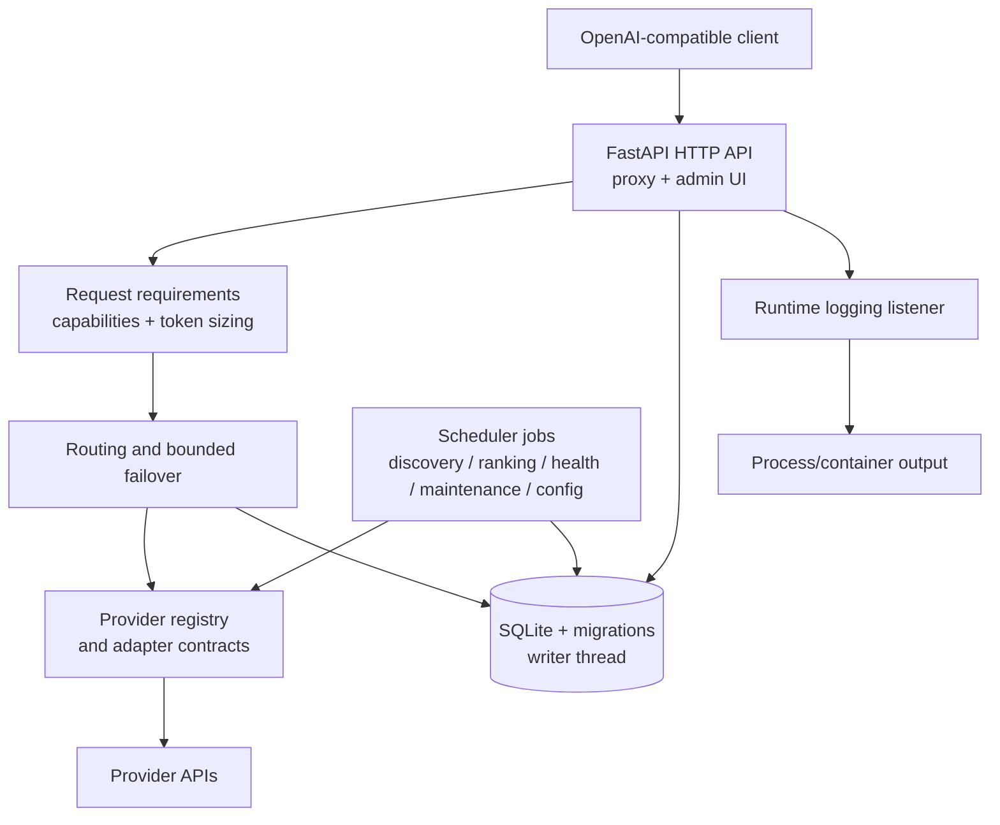

# Architecture

This document records stable design intent and boundaries. It is not a second
inventory of routes, settings, providers, or dependencies. Those facts come
from the code, `config.yaml.example`, `pyproject.toml`, and the CI workflows.
The FastAPI application also publishes the current API schema at `/openapi.json`.

## Shape of the system

FreeLunch is one deployable, single-node process with logical boundaries:



The main runtime entry point is [`src/main.py`](../src/main.py). Request
orchestration is in [`src/proxy.py`](../src/proxy.py), candidate selection is
in [`src/routing.py`](../src/routing.py), and provider-specific behavior stays
under [`src/providers/`](../src/providers/).

## Boundaries and responsibilities

| Boundary | Responsibility | Source of truth |
| --- | --- | --- |
| HTTP/API | OpenAI-compatible requests, admin endpoints, auth, streaming | [`src/proxy.py`](../src/proxy.py), [`src/admin_ui.py`](../src/admin_ui.py) |
| Requirements | Capability detection and context/output sizing | [`src/tokens.py`](../src/tokens.py) |
| Routing | Hard candidate filtering, score ordering, bounded failover | [`src/routing.py`](../src/routing.py) |
| Provider contract | Discovery, inference, probes, normalized errors and runtime state | [`src/providers/base.py`](../src/providers/base.py) |
| Provider implementations | API and provider quirks | [`src/providers/`](../src/providers/) |
| State | Schema, migrations, reads, and serialized application writes | [`src/db.py`](../src/db.py) |
| Inventory and scoring | Discovery reconciliation, benchmark joins, model scores | [`src/discover.py`](../src/discover.py), [`src/ranking.py`](../src/ranking.py), [`src/benchmarks.py`](../src/benchmarks.py) |
| Health | Passive outcomes, probes, cooldowns, budgets | [`src/health.py`](../src/health.py) |
| Scheduling | Periodic discovery, ranking, health, maintenance, config refresh | [`src/scheduler.py`](../src/scheduler.py) |
| Operational logs | Queue-backed JSON process events | [`src/runtime_logging.py`](../src/runtime_logging.py) |

## Architectural invariants

- Provider-specific behavior remains inside provider adapters; routing, health,
  and proxy orchestration remain provider-agnostic.
- SQLite is a single-node durability layer. Normal application writes go
  through the dedicated writer thread; low-priority request logs may be
  dropped under queue pressure while metadata writes receive protection.
- Request routing first applies hard constraints (active/healthy state,
  capabilities, context and output fit), then applies preference and score
  ordering. Failover is bounded and does not replay a partially emitted stream.
- Runtime logs and durable request telemetry are separate planes.
- The OpenRouter no-key stub is explicit development behavior and cannot make a
  production deployment ready.
- Timestamps persisted by the application are UTC ISO 8601 with a `Z` suffix.

## Runtime flows

### Startup and readiness

`main.py` loads configuration, configures runtime logging, initializes SQLite,
starts the writer, registers providers, runs discovery/ranking/health bootstrap,
computes readiness, and registers scheduler jobs. `/healthz` reports process
liveness. `/readyz` is successful only when at least one routable model exists.

### Request and failover

`proxy.py` parses the request and delegates requirements to `tokens.py`. Routing
filters candidates, orders them, and invokes the selected adapter. Retryable
provider failures can move to the next bounded candidate. A context-only
exhaustion is reported as a client `400`; context failures do not penalize
provider health. Streaming may fail over only before output has begun.

### Background maintenance

The scheduler refreshes provider models and best-effort benchmark data, updates
scores, probes health within per-provider budgets, prunes old request logs, and
refreshes runtime overrides. External benchmark or tokenizer enrichment failure
degrades optional enrichment rather than taking down the gateway.

## Trust boundaries

Treat all client requests, provider responses, benchmark artifacts, and remote
tokenizer metadata as untrusted input. Provider credentials and the gateway
bearer token are secrets. The admin API and UI are privileged operations and
must be protected by gateway auth plus suitable network controls before remote
exposure. Remote tokenizer loading uses `trust_remote_code=False`.

## Code-driven mapping

The stable content above explains intent; detailed architecture facts are
derived from code by [`scripts/generate_architecture.py`](../scripts/generate_architecture.py).
It uses standard-library AST inspection to generate:

- [`docs/generated/architecture-inventory.md`](./generated/architecture-inventory.md)
  with a rendered Mermaid dependency graph plus module dependencies, routes,
  provider modules, scheduler jobs, and `Settings` fields;
- [`docs/generated/module-dependencies.mmd`](./generated/module-dependencies.mmd)
  with a high-level module graph.

Regenerate after source changes and use check mode in CI:

```bash
python scripts/generate_architecture.py
python scripts/generate_architecture.py --check
```

Keep generated files out of manual edits. The generated inventory records facts;
this document records intent and invariants.

When a change crosses a boundary, update the relevant implementation and tests
first, then update this document only for changed intent or invariants.
