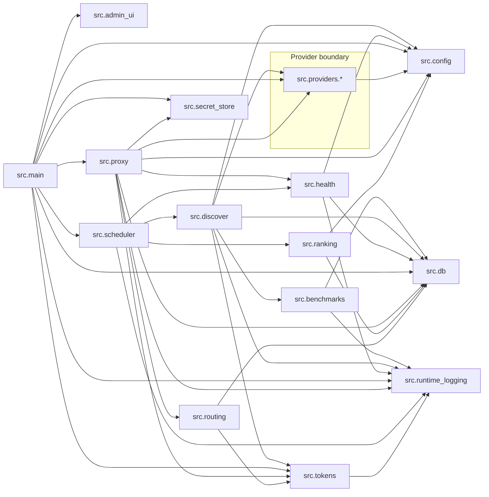

<!-- Generated by scripts/generate_architecture.py; do not edit manually. -->
<!-- Run `python scripts/generate_architecture.py` after source changes. -->

# Architecture inventory

This file is generated from the Python source tree using static AST inspection. It records implementation facts; architectural intent belongs in `docs/architecture.md`.

The high-level module relationship graph is rendered below and is also available as standalone [Mermaid source](module-dependencies.mmd).

## Module dependency graph

## Source modules and dependencies

| Module | Internal dependencies | External imports |
| --- | --- | --- |
| `src.admin_ui` | — | `fastapi` |
| `src.benchmarks` | `src.db`, `src.runtime_logging` | `httpx` |
| `src.config` | — | `yaml` |
| `src.db` | — | — |
| `src.discover` | `src.benchmarks`, `src.config`, `src.db`, `src.providers.registry`, `src.runtime_logging`, `src.tokens` | — |
| `src.health` | `src.config`, `src.db`, `src.runtime_logging` | — |
| `src.main` | `src.admin_ui`, `src.config`, `src.db`, `src.providers.registry`, `src.proxy`, `src.runtime_logging`, `src.scheduler`, `src.secret_store`, `src.tokens` | `apscheduler`, `fastapi` |
| `src.providers.base` | — | — |
| `src.providers.cerebras` | `src.providers.openai_compatible`, `src.providers.registry` | — |
| `src.providers.deepseek` | `src.providers.openai_compatible`, `src.providers.registry` | — |
| `src.providers.groq` | `src.providers.openai_compatible`, `src.providers.registry` | — |
| `src.providers.nvidia` | `src.providers.openai_compatible`, `src.providers.registry` | — |
| `src.providers.openai` | `src.providers.openai_compatible`, `src.providers.registry` | — |
| `src.providers.openai_compatible` | `src.providers.base` | `httpx` |
| `src.providers.openrouter` | `src.providers.base` | `httpx` |
| `src.providers.perplexity` | `src.providers.openai_compatible`, `src.providers.registry` | — |
| `src.providers.registry` | `src.config`, `src.providers.base`, `src.providers.cerebras`, `src.providers.deepseek`, `src.providers.groq`, `src.providers.nvidia`, `src.providers.openai`, `src.providers.openrouter`, `src.providers.perplexity`, `src.providers.together`, `src.providers.xai` | — |
| `src.providers.together` | `src.providers.openai_compatible`, `src.providers.registry` | — |
| `src.providers.xai` | `src.providers.openai_compatible`, `src.providers.registry` | — |
| `src.proxy` | `src.config`, `src.db`, `src.health`, `src.providers.base`, `src.routing`, `src.runtime_logging`, `src.secret_store`, `src.tokens` | `fastapi` |
| `src.ranking` | `src.config`, `src.db` | — |
| `src.routing` | `src.db`, `src.tokens` | — |
| `src.runtime_logging` | — | — |
| `src.scheduler` | `src.discover`, `src.health`, `src.ranking`, `src.runtime_logging` | `apscheduler` |
| `src.secret_store` | — | `cryptography` |
| `src.tokens` | `src.runtime_logging` | `tiktoken`, `transformers` |

## HTTP routes

| Method | Path | Handler | Source |
| --- | --- | --- | --- |
| GET | `/admin/config` | `admin_config` | [src/proxy.py:705](../../src/proxy.py#L705) |
| DELETE | `/admin/config/{key:path}` | `admin_delete_config` | [src/proxy.py:989](../../src/proxy.py#L989) |
| PUT | `/admin/config/{key:path}` | `admin_set_config` | [src/proxy.py:958](../../src/proxy.py#L958) |
| DELETE | `/admin/gateway-auth` | `admin_disable_gateway_auth` | [src/proxy.py:762](../../src/proxy.py#L762) |
| GET | `/admin/gateway-auth` | `admin_gateway_auth` | [src/proxy.py:727](../../src/proxy.py#L727) |
| PUT | `/admin/gateway-auth` | `admin_set_gateway_auth` | [src/proxy.py:734](../../src/proxy.py#L734) |
| POST | `/admin/gateway-auth/inherit` | `admin_inherit_gateway_auth` | [src/proxy.py:779](../../src/proxy.py#L779) |
| GET | `/admin/health` | `admin_health` | [src/proxy.py:641](../../src/proxy.py#L641) |
| GET | `/admin/logs` | `admin_logs` | [src/proxy.py:1035](../../src/proxy.py#L1035) |
| GET | `/admin/models` | `admin_models` | [src/proxy.py:566](../../src/proxy.py#L566) |
| GET | `/admin/models/{model_id:path}` | `admin_model_detail` | [src/proxy.py:586](../../src/proxy.py#L586) |
| POST | `/admin/models/{model_id:path}/disable` | `admin_disable_model` | [src/proxy.py:609](../../src/proxy.py#L609) |
| POST | `/admin/models/{model_id:path}/enable` | `admin_enable_model` | [src/proxy.py:625](../../src/proxy.py#L625) |
| POST | `/admin/refresh` | `admin_refresh` | [src/proxy.py:1013](../../src/proxy.py#L1013) |
| GET | `/admin/secrets` | `admin_secrets` | [src/proxy.py:796](../../src/proxy.py#L796) |
| POST | `/admin/secrets/vault/lock` | `admin_lock_secret_vault` | [src/proxy.py:873](../../src/proxy.py#L873) |
| POST | `/admin/secrets/vault/setup` | `admin_setup_secret_vault` | [src/proxy.py:806](../../src/proxy.py#L806) |
| POST | `/admin/secrets/vault/unlock` | `admin_unlock_secret_vault` | [src/proxy.py:842](../../src/proxy.py#L842) |
| DELETE | `/admin/secrets/{secret_key:path}` | `admin_delete_secret` | [src/proxy.py:926](../../src/proxy.py#L926) |
| PUT | `/admin/secrets/{secret_key:path}` | `admin_set_secret` | [src/proxy.py:895](../../src/proxy.py#L895) |
| GET | `/admin/ui` | `admin_ui_index` | [src/admin_ui.py:15](../../src/admin_ui.py#L15) |
| GET | `/admin/ui/` | `admin_ui_trailing_slash` | [src/admin_ui.py:19](../../src/admin_ui.py#L19) |
| GET | `/admin/ui/{asset_path:path}` | `admin_ui_asset` | [src/admin_ui.py:23](../../src/admin_ui.py#L23) |
| GET | `/admin/uninstall` | `admin_uninstall_info` | [src/proxy.py:951](../../src/proxy.py#L951) |
| GET | `/healthz` | `healthz` | [src/proxy.py:544](../../src/proxy.py#L544) |
| GET | `/readyz` | `readyz` | [src/proxy.py:548](../../src/proxy.py#L548) |
| POST | `/v1/chat/completions` | `chat_completions` | [src/proxy.py:1119](../../src/proxy.py#L1119) |
| GET | `/v1/models` | `list_models` | [src/proxy.py:553](../../src/proxy.py#L553) |

## Provider modules

| Module | Provider name | Adapter classes | Factory |
| --- | --- | --- | --- |
| `src.providers.cerebras` | `cerebras` | `CerebrasAdapter` | `build_provider_adapter` |
| `src.providers.deepseek` | `deepseek` | `DeepSeekAdapter` | `build_provider_adapter` |
| `src.providers.groq` | `groq` | `GroqAdapter` | `build_provider_adapter` |
| `src.providers.nvidia` | `nvidia` | `NvidiaAdapter` | `build_provider_adapter` |
| `src.providers.openai` | `openai` | `OpenAIAdapter` | `build_provider_adapter` |
| `src.providers.openai_compatible` | `openai_compatible` | `OpenAICompatibleAdapter` | — |
| `src.providers.openrouter` | `openrouter` | `OpenRouterAdapter` | — |
| `src.providers.perplexity` | `perplexity` | `PerplexityAdapter` | `build_provider_adapter` |
| `src.providers.together` | `together` | `TogetherAdapter` | `build_provider_adapter` |
| `src.providers.xai` | `xai` | `XAIAdapter` | `build_provider_adapter` |

## Scheduled jobs

| Job id | Callback | Trigger | Source |
| --- | --- | --- | --- |
| `config_refresh` | `config_refresh_job` | `IntervalTrigger(minutes=5)` | [src/scheduler.py:246](../../src/scheduler.py#L246) |
| `discovery` | `discovery_runner` | `IntervalTrigger(minutes=app_state.settings.discovery_interval_minutes)` | [src/scheduler.py:214](../../src/scheduler.py#L214) |
| `health` | `health_job` | `IntervalTrigger(minutes=app_state.settings.health_probe_interval_minutes)` | [src/scheduler.py:230](../../src/scheduler.py#L230) |
| `maintenance` | `maintenance_job` | `IntervalTrigger(hours=24)` | [src/scheduler.py:238](../../src/scheduler.py#L238) |
| `ranking` | `rank_job` | `IntervalTrigger(minutes=app_state.settings.ranking_interval_minutes)` | [src/scheduler.py:222](../../src/scheduler.py#L222) |

## `Settings` fields

| Field | Type | Default | Source |
| --- | --- | --- | --- |
| `openrouter_api_key` | `str` | `''` | [src/config.py:58](../../src/config.py#L58) |
| `gateway_api_key` | `str` | `''` | [src/config.py:59](../../src/config.py#L59) |
| `gateway_host` | `str` | `'0.0.0.0'` | [src/config.py:60](../../src/config.py#L60) |
| `gateway_port` | `int` | `8000` | [src/config.py:61](../../src/config.py#L61) |
| `gateway_workers` | `int` | `1` | [src/config.py:62](../../src/config.py#L62) |
| `gateway_log_level` | `str` | `'info'` | [src/config.py:63](../../src/config.py#L63) |
| `database_url` | `str` | `'freelunch.db'` | [src/config.py:64](../../src/config.py#L64) |
| `database_busy_timeout_ms` | `int` | `5000` | [src/config.py:65](../../src/config.py#L65) |
| `app_env` | `str` | `'dev'` | [src/config.py:66](../../src/config.py#L66) |
| `providers_enabled` | `tuple[str, ...]` | `('openrouter',)` | [src/config.py:67](../../src/config.py#L67) |
| `provider_enabled` | `dict[str, bool]` | `field(default_factory=dict)` | [src/config.py:68](../../src/config.py#L68) |
| `provider_discovery_enabled` | `dict[str, bool]` | `field(default_factory=dict)` | [src/config.py:69](../../src/config.py#L69) |
| `provider_inference_enabled` | `dict[str, bool]` | `field(default_factory=dict)` | [src/config.py:70](../../src/config.py#L70) |
| `provider_active_probe_enabled` | `dict[str, bool]` | `field(default_factory=dict)` | [src/config.py:71](../../src/config.py#L71) |
| `provider_bootstrap_config` | `dict[str, dict[str, Any]]` | `field(default_factory=dict)` | [src/config.py:72](../../src/config.py#L72) |
| `openrouter_enabled` | `bool` | `True` | [src/config.py:73](../../src/config.py#L73) |
| `openrouter_discovery_enabled` | `bool` | `True` | [src/config.py:74](../../src/config.py#L74) |
| `openrouter_inference_enabled` | `bool` | `True` | [src/config.py:75](../../src/config.py#L75) |
| `openrouter_dev_stub_enabled` | `bool` | `False` | [src/config.py:76](../../src/config.py#L76) |
| `discovery_interval_minutes` | `int` | `30` | [src/config.py:77](../../src/config.py#L77) |
| `discovery_request_timeout_seconds` | `int` | `15` | [src/config.py:78](../../src/config.py#L78) |
| `discovery_leaderboard_chatbot_arena_enabled` | `bool` | `True` | [src/config.py:79](../../src/config.py#L79) |
| `discovery_leaderboard_chatbot_arena_cache_hours` | `int` | `24` | [src/config.py:80](../../src/config.py#L80) |
| `discovery_leaderboard_open_llm_enabled` | `bool` | `True` | [src/config.py:81](../../src/config.py#L81) |
| `discovery_leaderboard_open_llm_cache_hours` | `int` | `24` | [src/config.py:82](../../src/config.py#L82) |
| `ranking_interval_minutes` | `int` | `15` | [src/config.py:83](../../src/config.py#L83) |
| `routing_max_attempts` | `int` | `3` | [src/config.py:84](../../src/config.py#L84) |
| `routing_enable_request_preference_headers` | `bool` | `True` | [src/config.py:85](../../src/config.py#L85) |
| `openrouter_api_base` | `str` | `'https://openrouter.ai/api/v1'` | [src/config.py:86](../../src/config.py#L86) |
| `openrouter_active_probe_enabled` | `bool` | `True` | [src/config.py:87](../../src/config.py#L87) |
| `ranking_weights` | `dict[str, float]` | `field(default_factory=lambda: dict(Settings.DEFAULT_RANKING_WEIGHTS))` | [src/config.py:88](../../src/config.py#L88) |
| `ranking_fallback_model` | `str` | `'openrouter/openrouter/free'` | [src/config.py:91](../../src/config.py#L91) |
| `health_probe_interval_minutes` | `int` | `180` | [src/config.py:92](../../src/config.py#L92) |
| `health_probe_timeout_seconds` | `int` | `15` | [src/config.py:93](../../src/config.py#L93) |
| `health_probe_concurrency` | `int` | `1` | [src/config.py:94](../../src/config.py#L94) |
| `health_max_probes_per_run` | `int` | `1` | [src/config.py:95](../../src/config.py#L95) |
| `health_stale_after_minutes` | `int` | `360` | [src/config.py:96](../../src/config.py#L96) |
| `health_top_n_stale_probe` | `int` | `3` | [src/config.py:97](../../src/config.py#L97) |
| `health_startup_probe_limit` | `int` | `2` | [src/config.py:98](../../src/config.py#L98) |
| `health_consecutive_failures_threshold` | `int` | `3` | [src/config.py:99](../../src/config.py#L99) |
| `health_cooldown_minutes` | `int` | `30` | [src/config.py:100](../../src/config.py#L100) |
| `health_max_backoff_exponent` | `int` | `4` | [src/config.py:101](../../src/config.py#L101) |
| `health_probe_max_tokens` | `int` | `1` | [src/config.py:102](../../src/config.py#L102) |
| `health_daily_request_budget_by_provider` | `dict[str, int]` | `field(default_factory=lambda: {'openrouter': 5})` | [src/config.py:103](../../src/config.py#L103) |
| `logging_request_log_enabled` | `bool` | `True` | [src/config.py:106](../../src/config.py#L106) |
| `logging_log_queue_size` | `int` | `5000` | [src/config.py:107](../../src/config.py#L107) |
| `logging_request_log_retention_days` | `int` | `30` | [src/config.py:108](../../src/config.py#L108) |
| `logging_runtime_enabled` | `bool` | `True` | [src/config.py:109](../../src/config.py#L109) |
| `logging_runtime_verbosity` | `str` | `'concise'` | [src/config.py:110](../../src/config.py#L110) |
| `logging_runtime_queue_size` | `int` | `1000` | [src/config.py:111](../../src/config.py#L111) |
